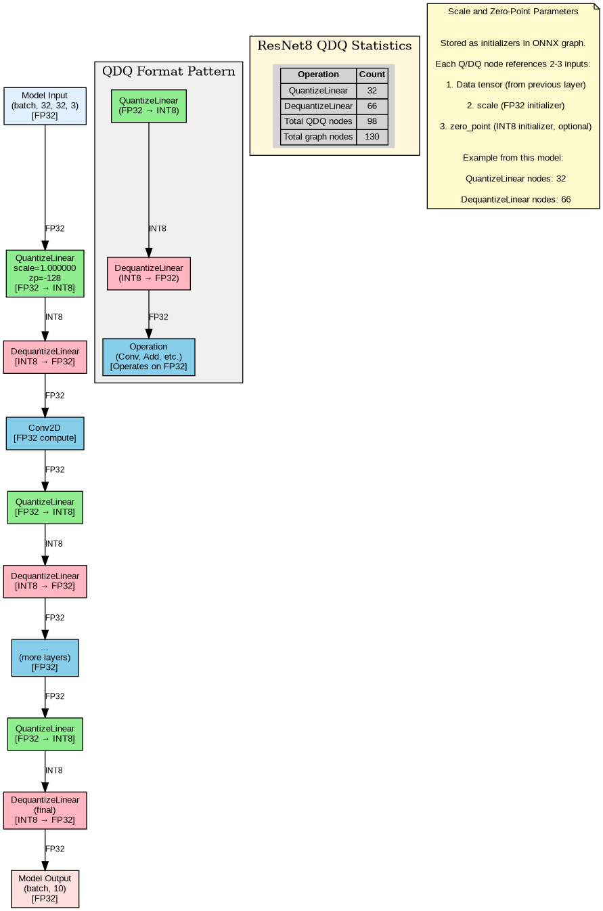

# QDQ Format Architecture

## Overview

This document describes the **QDQ (Quantize-Dequantize) format architecture** used in quantized ResNet8 ONNX models. Unlike specialized quantized operators (QLinearConv, QLinearMatMul), QDQ format uses pairs of QuantizeLinear/DequantizeLinear nodes around standard floating-point operators. This approach offers better debugging, easier optimization, and wider hardware support.

**Key architectural insight:** In QDQ format, standard operators (Conv, Add, MatMul) process **FP32 data**, not INT8. The Q/DQ pairs manage the conversions, enabling INT8 storage while maintaining FP32 computation semantics.

For detailed explanations of individual boundary operations, see [01-boundary-operations.md](01-boundary-operations.md). For core quantized operations, see [02-qlinear-conv.md](02-qlinear-conv.md) and [03-qlinear-matmul.md](03-qlinear-matmul.md).

---

## QDQ Format vs QLinear Operators

### QLinear Operators (Specification Reference)

The ONNX specification defines specialized quantized operators:
- **QLinearConv**: Fused quantized convolution
- **QLinearMatMul**: Fused quantized matrix multiplication

These operators take INT8 inputs directly and perform computation in INT32 accumulator space. They are documented in the specification but **rarely used in practice**.

### QDQ Format (Actual Model Implementation)

Real-world quantized models use the **QDQ format pattern**:

```
FP32 Input → QuantizeLinear → DequantizeLinear → Conv(FP32) → QuantizeLinear → DequantizeLinear → FP32 Output
```

**Why QDQ format is preferred:**

1. **Better debugging**: Intermediate values can be inspected as FP32
2. **Easier optimization**: ONNX Runtime can fuse Q/DQ pairs during graph optimization
3. **Wider hardware support**: Standard FP32 operators are universally supported
4. **Gradual quantization**: Individual layers can be quantized independently
5. **Framework compatibility**: Easier to convert from PyTorch/TensorFlow

**Runtime optimization:** ONNX Runtime fuses consecutive Q-DQ-Op sequences into efficient INT8 kernels at inference time, achieving the same performance as QLinear operators while maintaining the flexibility of the QDQ representation.

### ResNet8 Architecture Statistics

Our quantized ResNet8 INT8 model demonstrates the QDQ pattern:

| Operation Type | Count | Purpose |
|----------------|-------|---------|
| QuantizeLinear | 32 | FP32 → INT8 conversions |
| DequantizeLinear | 66 | INT8 → FP32 conversions |
| QLinearConv | 0 | (Not used in QDQ format) |
| QLinearMatMul | 0 | (Not used in QDQ format) |
| **Total QDQ nodes** | **98** | 75% of graph (130 total nodes) |

The asymmetry (32 Q vs 66 DQ) arises because:
- Weights are pre-quantized as initializers (don't need runtime QuantizeLinear)
- Each weight DQ node converts stored INT8 weights to FP32 for the operation
- Activations require both Q (after operation) and DQ (before operation) nodes

---

## Data Flow Through Quantized ResNet8

### Complete Network Path

```
FP32 Input (batch, 32, 32, 3)
    ↓
[QuantizeLinear] ← Input quantization
    ↓ INT8
[DequantizeLinear]
    ↓ FP32
[Conv2D] ← Conv1 layer
    ↓ FP32
[QuantizeLinear]
    ↓ INT8
[DequantizeLinear]
    ↓ FP32
[Conv2D + BatchNorm + ReLU] ← ResNet blocks (3 blocks × 2 layers each)
    ↓ FP32
[QuantizeLinear]
    ↓ INT8
[DequantizeLinear]
    ↓ FP32
[GlobalAveragePooling]
    ↓ FP32
[QuantizeLinear]
    ↓ INT8
[DequantizeLinear]
    ↓ FP32
[Dense/Gemm] ← Final classification layer
    ↓ FP32
[QuantizeLinear]
    ↓ INT8
[DequantizeLinear] ← Output dequantization
    ↓
FP32 Output (batch, 10)
```

### Layer-by-Layer Breakdown

**ResNet8 structure:**
- **conv1**: Initial 3×3 convolution (3 → 16 channels)
- **block1**: 2× (3×3 conv, 16 channels)
- **block2**: 2× (3×3 conv, 32 channels, stride 2 in first conv)
- **block3**: 2× (3×3 conv, 64 channels, stride 2 in first conv)
- **pool**: Global average pooling
- **dense**: Fully connected layer (64 → 10 classes)

Each convolution layer follows this pattern:

```
[DequantizeLinear] ← Convert weight initializer INT8 → FP32
    ↓ FP32 weight
[Conv2D] ← Takes FP32 activation + FP32 weight
    ↓ FP32 output
[QuantizeLinear] ← Convert activation FP32 → INT8
```

### Residual Connections

ResNet's skip connections require special handling in QDQ format:

```
Branch A (main path):
  FP32 → [Q] → INT8 → [DQ] → FP32 → [Conv] → FP32 → [Q] → INT8 → [DQ] → FP32

Branch B (skip connection):
  FP32 → [Q] → INT8 → [DQ] → FP32

Merge:
  FP32 (Branch A) + FP32 (Branch B) → [Add] → FP32 → [Q] → INT8
```

Both branches must be dequantized to FP32 before the Add operation, then the result is quantized back to INT8.

---

## Residual Connections in Quantized Networks

ResNet architectures rely on skip connections that add outputs from different layers. In quantized networks, these residual connections present a unique challenge: **branches may have different quantization scales**, making direct INT8 addition mathematically incorrect.

### 5.1 The Scale Mismatch Problem

In ResNet, residual connections add two branches:

```
output = conv_branch + skip_branch
```

In quantized networks, each branch may have different scales. Consider this example from ResNet8:

**Residual connection 1** (`model_1/add_1/Add`):
- Branch 1 scale: 0.046150 (activation from conv path)
- Branch 2 scale: 0.122343 (skip connection path)

The same INT8 value represents different FP32 magnitudes in each branch:
- INT8 value 100 in Branch 1 represents: 100 × 0.046150 = 4.615
- INT8 value 100 in Branch 2 represents: 100 × 0.122343 = 12.234

**Direct INT8 addition would be incorrect:**
```
100 (Branch 1) + 100 (Branch 2) = 200 (INT8)
But mathematically: 4.615 + 12.234 = 16.849 ≠ 200 × (any single scale)
```

This scale mismatch problem occurs at every residual connection in quantized ResNets.

### 5.2 QDQ Solution (Used in ResNet8)

ResNet8's quantized model uses the **QDQ dequant-add-quant pattern**:

```
Branch 1: ... → QuantizeLinear → INT8 → DequantizeLinear(scale₁) → FP32 → \
                                                                            Add(FP32) → QuantizeLinear → INT8 → ...
Branch 2: ... → QuantizeLinear → INT8 → DequantizeLinear(scale₂) → FP32 → /
```

**How it works:**
1. **Dequantize both branches** to FP32 using their respective scales
2. **Perform addition** in floating-point (mathematically correct)
3. **Quantize result** back to INT8 with output scale

**Example from ResNet8 residual connection:**

```python
# Branch 1: scale=0.046150, zero_point=-128
branch1_fp32 = (branch1_int8 - (-128)) * 0.046150

# Branch 2: scale=0.122343, zero_point=1
branch2_fp32 = (branch2_int8 - 1) * 0.122343

# Add in FP32 space (correct)
result_fp32 = branch1_fp32 + branch2_fp32

# Quantize result (output scale=0.040123, zero_point=-128)
result_int8 = clip(round(result_fp32 / 0.040123) + (-128), -128, 127)
```

**Trade-off:** Requires FP32 arithmetic for Add operation, but ensures mathematical correctness regardless of scale mismatch.

### 5.3 Alternative Approaches (For Reference)

Other quantization frameworks use different approaches:

**Approach 1: Scale Matching (Hardware Optimization)**

Force both branches to use identical scales during calibration:
```
Branch 1: ... → INT8 (scale=S) → \
                                   Add(INT8, both use scale S) → INT8
Branch 2: ... → INT8 (scale=S) → /
```

- **Pro**: Pure INT8 addition possible (faster on some hardware)
- **Con**: Constrains calibration, may reduce accuracy
- **Requires**: Special calibration strategy to match scales

**Approach 2: INT8 Addition with Rescaling**

Rescale one branch to match the other before adding:
```
# Rescale Branch 2 to Branch 1's scale
scale_factor = scale₂ / scale₁
branch2_rescaled = (branch2_int8 * scale_factor).round().clip(-128, 127)
result_int8 = branch1_int8 + branch2_rescaled
```

- **Pro**: No FP32 required
- **Con**: Additional rounding error, complex implementation
- **Requires**: Runtime rescaling logic

**Approach 3: PyTorch FloatFunctional**

PyTorch's quantization-aware approach:
```python
# In model definition:
self.add = torch.ao.nn.quantized.FloatFunctional()

# In forward pass:
out = self.add.add(branch1, branch2)
```

- Wraps add operation to track quantization statistics
- Automatically handles scale/zero-point mismatches
- Exports to ONNX as QDQ pattern (same as Section 5.2)

For more details, see [PyTorch FloatFunctional documentation](https://pytorch.org/docs/stable/generated/torch.ao.nn.quantized.FloatFunctional.html).

### 5.4 ResNet8 Specific Analysis

ResNet8 has **3 primary residual skip connections** where different computational paths merge:

| Add Node | Branch 1 Scale | Branch 2 Scale | Scale Ratio |
|----------|----------------|----------------|-------------|
| `model_1/add_1/Add` | 0.046150 | 0.122343 | 2.65× |
| `model_1/add_1_2/Add` | 0.045742 | 0.151687 | 3.32× |
| `model_1/add_2_1/Add` | 0.086567 | 0.239572 | 2.77× |

**Key observations:**

1. **Significant scale mismatches**: Ratios range from 2.65× to 3.32×, making direct INT8 addition impossible
2. **All use QDQ pattern**: Each Add node receives inputs from two DequantizeLinear nodes
3. **Different scales per connection**: Each residual point has unique scale values based on calibration

**Full pattern for residual connection 1:**
```
Skip path (Branch 1):
  model_1/activation_1/Relu:0 (INT8)
  → DequantizeLinear(scale=0.046150, zero_point=-128)
  → FP32

Main path (Branch 2):
  model_1/batch_normalization_2_1/batchnorm/add_1:0 (INT8)
  → DequantizeLinear(scale=0.122343, zero_point=1)
  → FP32

Merge:
  FP32 + FP32 → Add → FP32
  → QuantizeLinear(scale=0.040123)
  → model_1/activation_2_1/Relu:0 (INT8)
```

**Additional Add operations**: ResNet8 also contains 8 Add operations within batch normalization layers (adding bias terms). These also use the QDQ pattern but operate on weight initializers rather than dual activation branches.

**Verification**: Use `scripts/extract_operations.py` to inspect Add nodes and their feeding DequantizeLinear operations to confirm scales:

```bash
python scripts/extract_operations.py --model models/resnet8_int8.onnx
# Then inspect operations JSON for Add nodes and trace back to DequantizeLinear scales
```

---

## Scale and Zero-Point Parameter Locations

### Initializers vs Runtime Inputs

ONNX graphs store quantization parameters in two ways:

1. **Initializers**: Pre-computed constant tensors stored in the model file
   - All scales (FP32 values)
   - All zero-points (INT8 values)
   - Quantized weights (INT8 tensors)

2. **Runtime inputs**: Data provided at inference time
   - Activation tensors (batch-dependent)

For quantization, **all scales and zero-points are initializers**, not runtime inputs. This enables:
- Faster inference (no runtime parameter lookup)
- Smaller memory footprint (parameters loaded once)
- Better optimization (constant folding)

### Naming Convention in ResNet8

The ONNX graph uses a systematic naming pattern for scale/zero-point initializers:

**Pattern:** `{layer_name}_{parameter_type}`

**Examples:**

| Initializer Name | Type | Value | Referenced By |
|------------------|------|-------|---------------|
| `model_1/conv2d_1/BiasAdd:0_scale` | FP32 | 0.003922 | QuantizeLinear after conv2d\_1 |
| `model_1/conv2d_1/BiasAdd:0_zero_point` | INT8 | -128 | QuantizeLinear after conv2d\_1 |
| `const_fold_opt__139_scale` | FP32 | 0.026843 | DequantizeLinear for weight tensor |
| `const_fold_opt__139_zero_point` | INT8 | -79 | DequantizeLinear for weight tensor |

**Naming patterns:**
- **Activation scales**: Named after the operation producing the activation (e.g., `BiasAdd:0_scale`)
- **Weight scales**: Often have `const_fold_opt__` prefix (compiler optimization artifacts)
- **Symmetric quantization**: zero\_point = 0 (weights) or -128 (uint8 activations)
- **Asymmetric quantization**: zero\_point ≠ 0 (specific to data distribution)

### QuantizeLinear Input Structure

Each QuantizeLinear node has **3 inputs**:

```python
QuantizeLinear(
    x,            # Input 0: FP32 tensor to quantize (from previous layer)
    y_scale,      # Input 1: FP32 scale initializer
    y_zero_point  # Input 2: INT8 zero-point initializer
)
→ y              # Output: INT8 quantized tensor
```

**Example from ResNet8:**

```json
{
  "name": "model_1/activation_1/Relu:0_QuantizeLinear",
  "op_type": "QuantizeLinear",
  "inputs": [
    "model_1/activation_1/Relu:0",           # FP32 activation from ReLU
    "model_1/activation_1/Relu:0_scale",     # FP32: 0.023529
    "model_1/activation_1/Relu:0_zero_point" # INT8: 0
  ],
  "outputs": [
    "model_1/activation_1/Relu:0_QuantizeLinear_Output"  # INT8 quantized activation
  ]
}
```

**How to locate parameters in ONNX graph:**
1. Find the QuantizeLinear/DequantizeLinear node by name
2. Read `inputs[1]` for the scale initializer name
3. Read `inputs[2]` for the zero-point initializer name
4. Look up those names in `graph.initializer` to get actual values

### DequantizeLinear Input Structure

Each DequantizeLinear node has **3 inputs** (similar structure):

```python
DequantizeLinear(
    x,            # Input 0: INT8 tensor to dequantize
    x_scale,      # Input 1: FP32 scale initializer
    x_zero_point  # Input 2: INT8 zero-point initializer
)
→ y              # Output: FP32 dequantized tensor
```

**Example from ResNet8 (weight dequantization):**

```json
{
  "name": "const_fold_opt__139_DequantizeLinear",
  "op_type": "DequantizeLinear",
  "inputs": [
    "const_fold_opt__139_quantized",    # INT8 weight tensor (initializer)
    "const_fold_opt__139_scale",        # FP32: 0.026843
    "const_fold_opt__139_zero_point"    # INT8: -79
  ],
  "outputs": [
    "const_fold_opt__139_DequantizeLinear_Output"  # FP32 weight for Conv
  ]
}
```

### Per-Tensor vs Per-Channel Quantization

ResNet8 uses **per-tensor quantization** (single scale/zero-point per layer):

| Quantization Type | Scale Shape | Zero-Point Shape | Use Case |
|-------------------|-------------|------------------|----------|
| **Per-tensor** | Scalar | Scalar | Activations, simple weights |
| **Per-channel** | (C,) | (C,) | Convolution weights (better accuracy) |

**Per-channel example** (not used in this model, but supported):
```python
# Convolution with 64 output channels would have:
scale = [0.012, 0.015, 0.011, ..., 0.013]  # 64 values
zero_point = [0, 0, 0, ..., 0]             # 64 values (typically all 0)
```

Per-channel quantization provides finer granularity (especially for convolutional weights) but increases parameter storage slightly. Our ResNet8 model achieves 86.75% accuracy with per-tensor quantization, so per-channel was not necessary.

---

## Network Visualization

The diagram below shows the QDQ architecture pattern and data flow through ResNet8:



**Legend:**
- **Green boxes**: QuantizeLinear nodes (FP32 → INT8)
- **Pink boxes**: DequantizeLinear nodes (INT8 → FP32)
- **Blue boxes**: Standard operators (Conv, Add, etc.) processing FP32 data
- **Edge labels**: Data type at each connection (FP32 or INT8)
- **Table**: Statistics showing 32 QuantizeLinear + 66 DequantizeLinear = 98 QDQ nodes

**Key observations from visualization:**

1. **Input quantization**: First QuantizeLinear converts FP32 input to INT8
2. **Weight dequantization**: Each convolution has a DequantizeLinear for its weights
3. **Activation quantization**: QuantizeLinear after each operation stores activations as INT8
4. **Activation dequantization**: DequantizeLinear before each operation converts INT8 → FP32
5. **Output dequantization**: Final DequantizeLinear ensures FP32 output for classification

### Generating Updated Visualizations

To regenerate the architecture diagram (e.g., after model changes):

```bash
# Extract operations from ONNX model
python scripts/extract_operations.py --model models/resnet8_int8.onnx

# Generate annotated architecture diagram
python scripts/annotate_qdq_graph.py --operations-json models/resnet8_int8_operations.json --output-dir docs/images/
```

The `annotate_qdq_graph.py` script creates:
- **PNG**: `docs/images/resnet8_qdq_architecture.png` (for documentation)
- **SVG**: `docs/images/resnet8_qdq_architecture.svg` (scalable vector format)
- **DOT**: `docs/images/resnet8_qdq_architecture.dot` (source format for Graphviz)

---

## Data Type Transitions

### Storage vs Computation

A crucial distinction in QDQ format:

| Stage | Data Type | Purpose |
|-------|-----------|---------|
| **Tensor storage** (between layers) | INT8 | Memory efficiency (4× smaller than FP32) |
| **Operation computation** (inside layers) | FP32 | Numerical stability and hardware compatibility |

**Workflow:**
1. Previous layer output stored as INT8 (via QuantizeLinear)
2. DequantizeLinear converts INT8 → FP32 before next operation
3. Operation (Conv, Add, etc.) computes in FP32
4. QuantizeLinear converts result FP32 → INT8 for storage

### Why Not Compute Directly in INT8?

QDQ format uses FP32 computation for several reasons:

1. **Hardware support**: FP32 operations are universally accelerated
2. **Numerical accuracy**: Intermediate results maintain precision
3. **Operator compatibility**: Standard ONNX operators are designed for FP32
4. **Optimization flexibility**: ONNX Runtime can fuse Q-DQ-Op at inference time

**Runtime optimization** (ONNX Runtime v1.10+):
The runtime detects patterns like `QuantizeLinear → DequantizeLinear → Conv → QuantizeLinear` and fuses them into efficient INT8 convolution kernels, achieving the performance of QLinearConv while maintaining QDQ format benefits.

### Memory Savings

Despite FP32 computation, QDQ format achieves significant memory savings:

**ResNet8 model size comparison:**

| Format | Size | Savings |
|--------|------|---------|
| FP32 (baseline) | 315 KB | - |
| INT8 (QDQ format) | 123 KB | 61% reduction |

**Breakdown:**
- **Weights**: Stored as INT8 (4× compression)
- **Activations**: Stored as INT8 during inference (4× compression)
- **Computation**: Temporary FP32 values (not stored long-term)

For batch inference, activation memory dominates, so INT8 storage provides substantial memory savings even with FP32 computation.

---

## PyTorch Equivalents

For reference, here's how QDQ patterns map to PyTorch quantization:

### PyTorch FX Graph Mode

```python
import torch
import torch.quantization.quantize_fx as quantize_fx

# Original model
model_fp32 = ResNet8()

# Prepare for quantization (inserts observers)
qconfig_dict = {"": torch.quantization.get_default_qconfig('fbgemm')}
model_prepared = quantize_fx.prepare_fx(model_fp32, qconfig_dict)

# Calibrate (observers collect statistics)
model_prepared(calibration_data)

# Convert to quantized model
model_int8 = quantize_fx.convert_fx(model_prepared)
```

**Resulting PyTorch graph:**
```
FP32 Input
  ↓
quantize_per_tensor (QuantizeLinear equivalent)
  ↓ INT8
dequantize (DequantizeLinear equivalent)
  ↓ FP32
conv2d (FP32 computation)
  ↓ FP32
quantize_per_tensor
  ↓ INT8
...
```

This matches ONNX QDQ format exactly, which is why PyTorch → ONNX conversion preserves the quantized graph structure.

### PyTorch Eager Mode

```python
# Manual Q/DQ insertion (eager mode)
class QuantizedBlock(nn.Module):
    def __init__(self):
        super().__init__()
        self.conv = nn.Conv2d(...)
        self.quant = torch.quantization.QuantStub()
        self.dequant = torch.quantization.DeQuantStub()

    def forward(self, x):
        x = self.dequant(x)  # INT8 → FP32
        x = self.conv(x)     # FP32 computation
        x = self.quant(x)    # FP32 → INT8
        return x
```

**QuantStub/DeQuantStub** are PyTorch's equivalents to ONNX QuantizeLinear/DequantizeLinear nodes.

---

## Cross-References

For implementation details of specific operations:

- **[01-boundary-operations.md](01-boundary-operations.md)**: QuantizeLinear/DequantizeLinear formulas, saturation, round-trip error
- **[02-qlinear-conv.md](02-qlinear-conv.md)**: QLinearConv specification (alternative to QDQ, rarely used)
- **[03-qlinear-matmul.md](03-qlinear-matmul.md)**: QLinearMatMul specification (alternative to QDQ, rarely used)

For hardware implementation guidance:
- **Phase 13 (Hardware Implementation Guide)**: Coming soon - critical pitfalls, pseudocode, test vectors

---

## Summary

**QDQ format architecture** is the practical approach to quantized neural networks:

1. **Pattern**: QuantizeLinear → DequantizeLinear → Operator (Conv, Add, etc.) → QuantizeLinear → ...
2. **Data flow**: FP32 input → INT8 storage → FP32 computation → INT8 storage → FP32 output
3. **Parameters**: Scales and zero-points stored as initializers in ONNX graph
4. **Benefits**: Better debugging, easier optimization, wider hardware support than QLinear operators
5. **Performance**: ONNX Runtime fuses Q-DQ-Op patterns into efficient INT8 kernels at inference time

**ResNet8 statistics**: 32 QuantizeLinear + 66 DequantizeLinear = 98 QDQ nodes (75% of 130 total nodes)

**Key insight**: QDQ format enables INT8 model compression (61% size reduction) while maintaining FP32 computation semantics, providing the best of both worlds for deployment.
